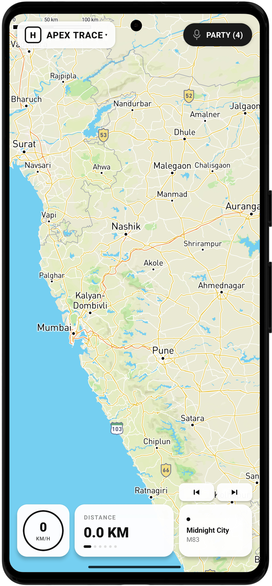

Here’s a clean, professional **README.md** you can directly paste into your GitHub repo 👇

---

# 🏍️ Apex Trace

Apex Trace is a **real-time rider companion app** designed for bikers who ride together.
It helps you **track rides, stay connected with your squad, and visualize your journey** — all in a clean, rider-focused dashboard.

---

## 🚀 Overview

Apex Trace aims to be the ultimate **on-road companion for motorcycle riders**, combining:

* 📍 Live GPS tracking
* 🗺️ Real-time map navigation
* 👥 Squad tracking (see your friends on the map)
* 🎙️ Voice communication during rides
* 📊 Ride stats and history

> Built with performance and minimal distraction in mind — because you're riding, not scrolling.

---

## 📸 Current Progress (Phase 2)

### 📊 Dashboard UI (Early Stage)

<p align="center">
  
</p>

> ⚠️ Currently only the **map rendering is functional**. Most features are under development.

---

## ✨ Features

### ✅ Implemented

* 🗺️ Interactive Map View
* 📍 Base GPS integration (initial)
* 🧭 Clean rider-focused UI layout (in progress)

---

### 🔜 Planned Features

#### 📡 Ride Tracking

* Real-time GPS tracking
* Speed (current, avg, top)
* Distance calculation
* Ride timer

#### 👥 Squad / Friends System

* Add & remove friends
* Live location sharing
* Group ride tracking

#### 🎙️ Voice Communication

* Create ride lobbies
* Talk with friends in real-time
* Mute/unmute controls

#### 📍 Navigation & Waypoints

* Add/remove markers
* Create custom routes
* Turn-by-turn navigation (future scope)

#### 📊 Ride Stats & History

* Save completed rides
* View ride analytics
* Replay ride paths

#### 🎵 Extra (Optional Future Ideas)

* Music control integration
* Ride notifications
* Crash detection (advanced)

---

## 🛠️ Tech Stack

* **React Native (Expo)**
* **TypeScript**
* **Mapbox / OpenStreetMap (planned)**
* **Firebase (planned)**
* **Agora / WebRTC (voice, planned)**

---

## 🗺️ Roadmap

Use this checklist to track progress:

### Phase 1 — Core

* [x] Setup project
* [x] Render map
* [ ] GPS tracking (accurate + continuous)
* [ ] Speed & distance calculations

### Phase 2 — UI / UX

* [x] Basic dashboard layout
* [ ] Speedometer widget
* [ ] Ride stats panel
* [ ] Orientation-based UI

### Phase 3 — Social Features

* [ ] Authentication system
* [ ] Add friends
* [ ] Real-time friend location sync
* [ ] Friend markers on map

### Phase 4 — Communication

* [ ] Voice chat integration
* [ ] Party/lobby system
* [ ] Mute/unmute controls

### Phase 5 — Navigation

* [ ] Waypoints system
* [ ] Route generation
* [ ] Route visualization

### Phase 6 — Ride Data

* [ ] Save rides
* [ ] Ride history screen
* [ ] Ride analytics

### Phase 7 — Polish

* [ ] UI animations
* [ ] Performance optimization
* [ ] Battery efficiency improvements
* [ ] Offline support (basic)

---

## 📦 Installation

```bash
git clone https://github.com/NotAl2/Apex-Trace.git
cd Apex-Trace
npm install
npx expo start
```

---

## ⚠️ Note

This project is currently in **early development (Phase 2)**.
Expect bugs, incomplete features, and frequent changes.

---

## 🤝 Contributing

Contributions, ideas, and suggestions are welcome!

* Open an issue
* Suggest features
* Submit PRs

---

## 📌 Vision

Apex Trace is being built to become:

> 🏍️ *“The Discord + Strava for Riders”*

A single app where riders can:

* Ride together
* Talk together
* Track everything

---

## 👨‍💻 Author

**Aryan Durgude**
GitHub: [https://github.com/NotAl2](https://github.com/NotAl2)

---

## ⭐ Support

If you like the project, consider giving it a ⭐ on GitHub!

---

### 🔥 Extra (Optional)

You can also include your dev prompt file here for contributors:

* 📄 Dev Prompts & Architecture → 

---

If you want, I can also:

* generate a **cool logo + banner**
* design a **landing page**
* or make your README look like a **top-tier open source project (animations, badges, etc.)**
